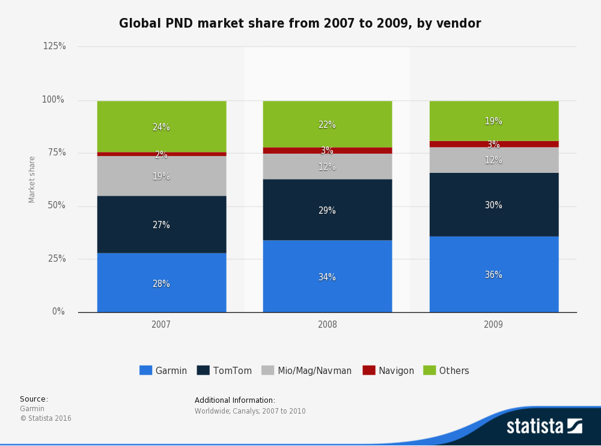
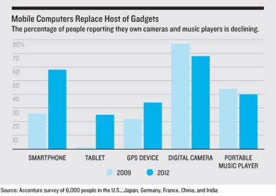
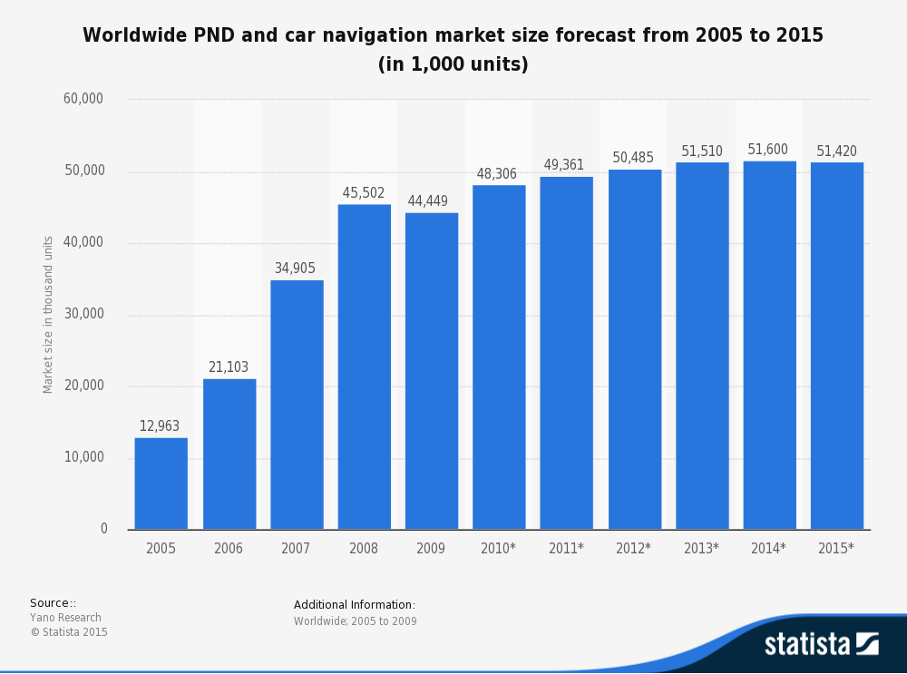
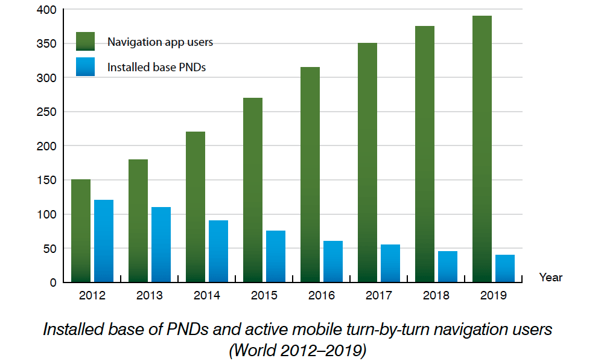

# A dive in to GPS Technology on SmartPhones: How did we get here?

Do you remember when you needed to print out [MapQuest](https://www.mapquest.com/) directions to get to a friend’s house? Or when you first used your phone to find the correct restaurant? The technology for picking up personal GPS location was not always so accurate. It took decades of political maneuvers and technology advancement to capture location from every person with a phone.

Let’s dive into the history: A few minutes past midnight on May 1st, 2000 changed the future of mobile data collection. On that date, President Clinton terminated the use of [Selective Availability](http://www.gps.gov/systems/gps/modernization/sa/). Public GPS signals no longer needed to be scrambled for national security purposes. Personal signals could have GPS readings of 30-40 feet instead of 300-400 ft. This move initiated the GPS navigation market for cars.

By this time, two companies were making waves with their bulky, expensive and, often times, difficult-to-use devices: [Garmin](http://garmin.com) and [Magellan](http://www.magellangps.com/). Magellan had created the world’s first commercial handheld GPS receiver in 1989, while Garmin had over 50 products on the market (and $3 million in sales). Both companies appealed to the boating, aviation and outdoor industries. A few years later, [TomTom](https://www.tomtom.com) emerged and revolutionized the personal navigation experience. TomTom, a small Dutch software company, began selling the [Personal Navigation Device (PND)](https://en.wikipedia.org/wiki/Personal_navigation_assistant), a user-friendly 3.5 inch color touch screen, at an affordable price. The PND market hit its peak in 2011 with more than 42 million units sold worldwide 

These devices quickly became successful in a short period of time, especially in car navigation systems. At this time, consumer electronic products and other navigation solutions, more specifically smartphone apps, started to emerge. GPS navigation on smartphones improved dramatically around 2008 and continued to pick up traction.

By 2010, more than 15 million North American customers subscribed to GPS navigation on their phones through data plans from large data providers, Sprint, AT&T, Verizon. Sprint and AT&T sold location apps based on [Telenav](https://www.telenav.com/)’s software, while Verizon used Networks In Motion (NIM).

Things started to change in October 2009 when Google announced a free navigation software for Android smartphones. Meanwhile, in December of that year Telecom Systems acquired NIM for $170 million and Telenav announced its IPO on the NASDAQ in early 2010. But by the end of 2010, more than 15 million North American customers subscribed to GPS navigation on their phones. They paid wireless operators $10 per month to gain location access.

[OpenStreetMap](https://openstreetmap.org) emerged as an alternative map database where data could be edited, exported, and imported into other systems for map navigation and reference.

At the same time, in a premium market segment (priced with a one-time license fee and embedded nation-wide maps) TomTom and Garmin offered their own smartphone apps with high-end features for Apple and Android.

[Wireless apps, data apps, Google maps]

[Need content here to bridge the gap between 2009 and now.]

Since around 2009 we have seen a continual decrease in PND market share while smartphone navigation app usage continues to increase. Today users can use smartphone apps for access to worldwide, fast, and detailed map data, even while outside of cellular signal range. While PND devices will still appeal to some niche users, it's become clear that their mass-adoption has peaked.

We are now entering a period where technologies, such as Fulcrum, Waze, Facebook and Instagram are using location as a way to connect people and collect data. These apps are gaining serious traction by offering free or low price, high volume and high ranking experiences. Are you joining the revolution?

### Related Links
 
* [http://www.directionsmag.com/pressreleases/berg-insight-says-pnd-shipments-will-peak-at-42-million-units-in-20111/141863](http://www.directionsmag.com/pressreleases/berg-insight-says-pnd-shipments-will-peak-at-42-million-units-in-20111/141863)
* [http://gpsworld.com/pnd-shipments-fell-to-22m-units-despite-nav-user-increase/](http://gpsworld.com/pnd-shipments-fell-to-22m-units-despite-nav-user-increase/)
* [http://www.yext.com/resources/pocket-guide-to-the-us-gps-navigation-market/quick-history-of-gps-navigation/](http://www.yext.com/resources/pocket-guide-to-the-us-gps-navigation-market/quick-history-of-gps-navigation/)
* [http://www.ebay.com/gds/The-Pros-and-Cons-of-Relying-on-a-Smartphones-GPS-Unit-/10000000177629662/g.html](http://www.ebay.com/gds/The-Pros-and-Cons-of-Relying-on-a-Smartphones-GPS-Unit-/10000000177629662/g.html)

### Resources

